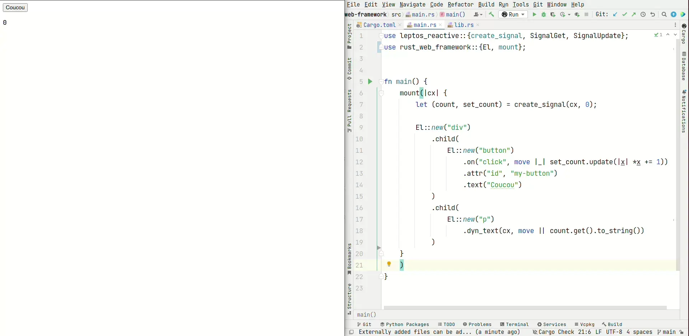

### Simple front-end framework with Rust and WASM



`web-sys` : DOM interactions
`leptos_reactive` : signals
`wasm-bindgen` : rendering the Rust code on the web

### Building

```bash
trunk build
```

This command should generate a dist/ folder to serve on the browser
